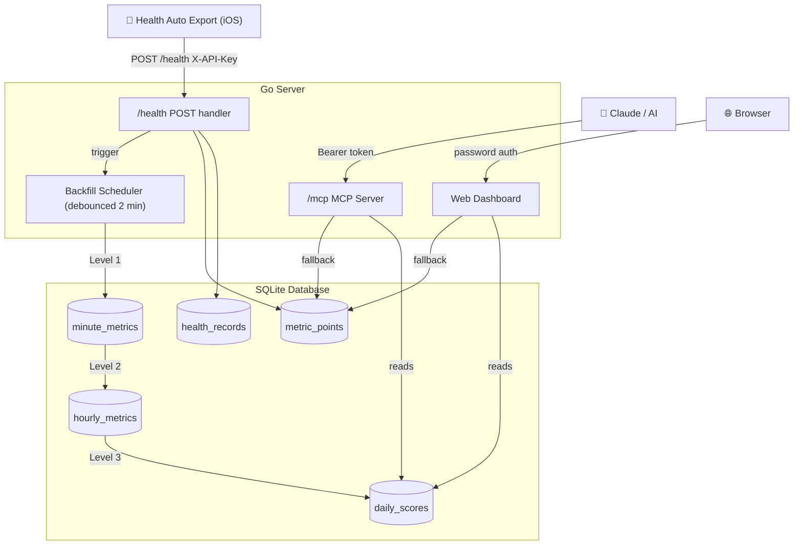

# Health Processing

Self-hosted server that receives data from the [Health Auto Export](https://www.healthyapps.dev) iOS app, stores it in SQLite, and provides a web dashboard and MCP server for AI-assisted analysis.

## How It Works



Data is stored in layers:

- **`health_records`** — raw JSON payloads, never modified
- **`metric_points`** — parsed time series, append-only
- **`minute_metrics` / `hourly_metrics`** — pre-aggregated caches (auto-maintained)
- **`daily_scores`** — daily rollups + readiness scores (auto-maintained)

The pre-aggregated tables are built automatically on startup and after each sync. They can be wiped and rebuilt at any time from `metric_points`.

## Quick Start

```bash
# Download docker-compose.yml
curl -O https://raw.githubusercontent.com/dzarlax/health_dashboard/main/docker-compose.yml

# Set secrets (edit the file or use environment variables)
# API_KEY=your-secret-key
# UI_PASSWORD=your-dashboard-password

docker compose up -d
```

Web UI will be available at `http://your-server:8080/`.

The image is published on Docker Hub: [`dzarlax/health_dashboard`](https://hub.docker.com/r/dzarlax/health_dashboard).

## Configuration

All configuration is via environment variables in `docker-compose.yml`:

| Variable | Required | Description |
|---|---|---|
| `API_KEY` | Recommended | Protects `/health` (data upload) and `/mcp`. If not set — endpoints are open. |
| `UI_PASSWORD` | Recommended | Password for the web dashboard at `/`. If not set — UI is open. |
| `DB_PATH` | No | Path to SQLite file. Default: `/app/data/health.db` |
| `ADDR` | No | Listen address. Default: `:8080` |
| `BASE_URL` | No | Used in logs for MCP URL. Default: `http://localhost:8080` |
| `TELEGRAM_TOKEN` | No | Telegram bot token for daily reports. If not set — reports disabled. |
| `TELEGRAM_CHAT_ID` | No | Telegram chat/user ID to send reports to. |
| `REPORT_LANG` | No | Report language: `en`, `ru`, `sr`. Default: `en`. |
| `REPORT_MORNING_WEEKDAY` | No | Hour (0–23) for morning sleep report on weekdays. Default: `8`. |
| `REPORT_MORNING_WEEKEND` | No | Hour (0–23) for morning sleep report on weekends. Default: `9`. |
| `REPORT_EVENING_WEEKDAY` | No | Hour (0–23) for evening day summary on weekdays. Default: `20`. |
| `REPORT_EVENING_WEEKEND` | No | Hour (0–23) for evening day summary on weekends. Default: `21`. |
| `REPORT_TZ` | No | Timezone for report scheduling (e.g. `Europe/Berlin`). Default: system local. |

## Health Auto Export Setup

1. Open **Health Auto Export** on iPhone
2. Go to **Automations** → Create new automation
3. Set **Export format**: `JSON`
4. Set **Destination**: `REST API`
5. Set **URL**: `http://your-server:8080/health`
6. Add **Header**: `X-API-Key: your-secret-key` (must match `API_KEY`)
7. Choose metrics and sync frequency

The app will POST data periodically. Supported metric types:
- Standard metrics with `qty` field (steps, calories, distance, etc.)
- `heart_rate` — uses `Avg` field from min/max/avg structure
- `sleep_analysis` — automatically split into `sleep_deep`, `sleep_rem`, `sleep_core`, `sleep_awake`, `sleep_total`

## Web Dashboard

Available at `/` — password protected if `UI_PASSWORD` is set.

Features:
- **Dashboard** — today's metrics with trend vs yesterday, sparklines, and featured 7-day charts
- **Health Briefing** — AI-style daily summary with readiness score, sleep analysis, insights, and health alerts (respiratory rate, wrist temperature, HRV variability anomalies)
- **Metrics view** — full list of available metrics with latest values; click any to open its chart
- **Metric charts** — time series with auto-bucketing (minute / hour / day)
- **Settings** — cache status, backfill controls, Telegram notification config, data gap detection, and Apple Health import (gear icon, top-right)
- URL hash state — shareable links like `/#metric=heart_rate&from=2026-01-01&to=2026-01-31`

## MCP Server

Available at `/mcp` for AI analysis via Claude or other MCP-compatible clients.

Authentication: `Authorization: Bearer your-api-key` or `X-API-Key: your-api-key` header.

Claude Desktop config (`~/Library/Application Support/Claude/claude_desktop_config.json`):

```json
{
  "mcpServers": {
    "health": {
      "url": "http://your-server:8080/mcp",
      "headers": {
        "Authorization": "Bearer your-secret-key"
      }
    }
  }
}
```

Available tools:

| Tool | Description |
|---|---|
| `get_health_briefing` | Full daily health briefing: readiness score (7-day HRV/RHR/sleep vs personal baseline), sleep analysis, activity, insights, and health alerts (RR/temperature/HRV anomalies). Best starting point. Supports `lang` (en/ru/sr). |
| `get_readiness_history` | Daily readiness scores (0–100) for the last N days. Score combines 7-day HRV trend, RHR, and sleep vs personal baseline. Includes oversleep penalty. |
| `list_metrics` | List all available metrics with record counts and date ranges. |
| `get_dashboard` | Today's summary: steps, calories, heart rate, SpO₂, HRV, sleep. Includes trend vs yesterday. |
| `get_metric_data` | Time series for a single metric. Supports minute / hour / day buckets and AVG / SUM / MIN / MAX aggregation. |
| `summarize_metric` | Statistical summary (avg, min, max, count) + daily breakdown for the last N days. |
| `compare_periods` | Compare a metric between two date ranges. Returns values and `change_pct`. Useful for before/after analysis. |
| `get_sleep_summary` | All sleep phases (deep, REM, core, awake, total) per night in one response. |
| `find_anomalies` | Days where a metric was statistically unusual (configurable σ threshold). |
| `get_weekly_summary` | Week-by-week aggregates for one or more metrics. |
| `get_personal_records` | All-time best and worst values per metric with dates. |
| `sql_query` | Run any read-only SQL SELECT directly on the database. Schemas for `daily_scores`, `hourly_metrics`, `minute_metrics`, and `metric_points` are documented in the tool description. |

## Telegram Reports

When `TELEGRAM_TOKEN` and `TELEGRAM_CHAT_ID` are set, the server sends two daily reports:

- **Morning** (weekday 08:00 / weekend 09:00) — sleep duration, phases (deep/REM/core/awake), readiness score, HRV and RHR
- **Evening** (weekday 20:00 / weekend 21:00) — steps, calories, exercise minutes, cardio summary, top insights

Times are configurable per weekday/weekend via env vars or through the Settings panel in the web UI (DB settings take priority over env vars). Timezone is controlled by `REPORT_TZ`. To get your `TELEGRAM_CHAT_ID`, send any message to your bot and call `https://api.telegram.org/bot<TOKEN>/getUpdates`. You can send test reports from the Settings panel.

## Apple Health Import

You can import a full Apple Health export (the `export.xml` or `.zip` from iPhone Settings → Health → Export All Health Data):

```bash
make import FILE=path/to/export.zip
```

The import streams the XML to avoid memory issues with large files. It can also be done via the web UI: Settings → Import. Percentage metrics (SpO₂, body fat, walking asymmetry, etc.) are automatically normalized from Apple Health's fraction format (0.96) to percentage scale (96%) during import.

## Maintenance

```bash
make dev              # run locally for development
make build            # compile binary to bin/server (requires CGO_ENABLED=1)
make migrate          # re-parse health_records → metric_points (run after adding new metric types)
make dedup            # rebuild metric_points with UNIQUE constraint (run once on old databases)
make backfill         # rebuild pre-aggregated caches from metric_points (incremental)
make backfill-force   # wipe and fully rebuild all caches
make import FILE=...  # import Apple Health export (ZIP or XML)
make docker-up        # build and start with Docker Compose
make docker-down      # stop all services
```

The cache tables (`minute_metrics`, `hourly_metrics`, `daily_scores`) are also rebuilt automatically:
- On server startup (incremental, fills missing rows only)
- After each `POST /health` sync (debounced, 2-minute delay)
- On demand via the Settings panel in the web UI

## Known Limitations

- **Timezone changes (travel)** — day boundaries use the device's local time at recording. When you travel across timezones, Apple Watch/iPhone update the offset automatically. Travel days may show reduced step counts, calories, and sleep duration because the calendar day is "compressed" (flying east) or "stretched" (flying west). Readiness scores self-correct after 1–2 days in the new timezone.
- **Multi-device deduplication** — when multiple devices (Apple Watch, iPhone, RingConn) record overlapping data, the system uses HealthKit-deduplicated records (pipe-separated source names) when available, falling back to MAX-per-source for XML-imported data. This handles most cases correctly but edge cases with partial syncs may slightly under- or over-count.
- **Percentage metrics from Apple Health XML** — SpO₂, body fat, walking asymmetry, etc. are stored as fractions (0.0–1.0) in Apple Health XML but as percentages (0–100) by Health Auto Export. The import automatically converts fractions to percentages, and existing data is migrated on server startup.

## Backups

The entire database is a single file: `./data/health.db`. Back it up by copying that file. For a live backup while the server is running:

```bash
sqlite3 ./data/health.db ".backup ./data/health.db.bak"
```
